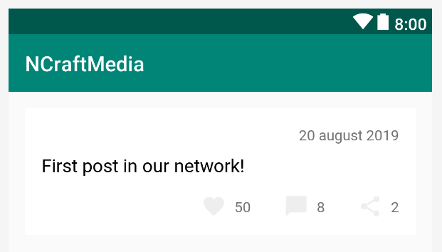
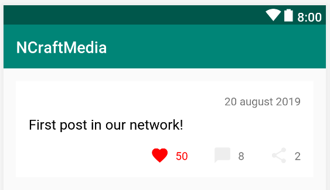
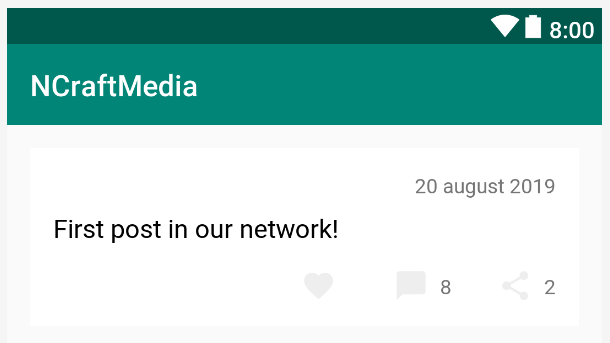
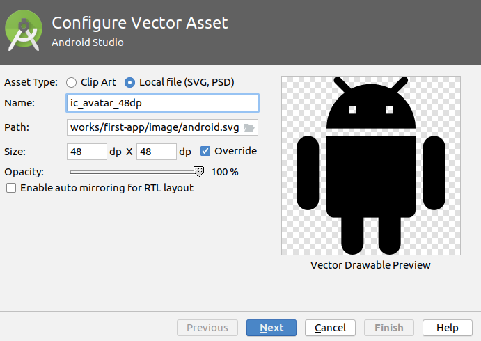
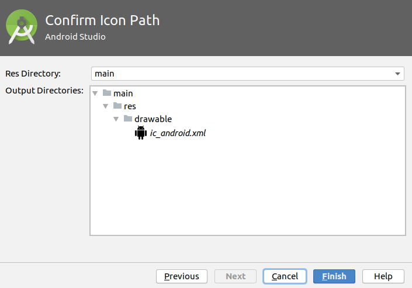
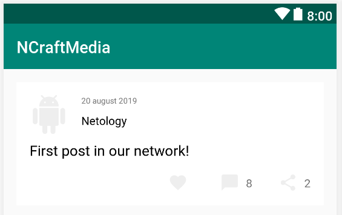
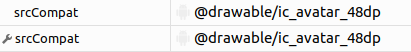
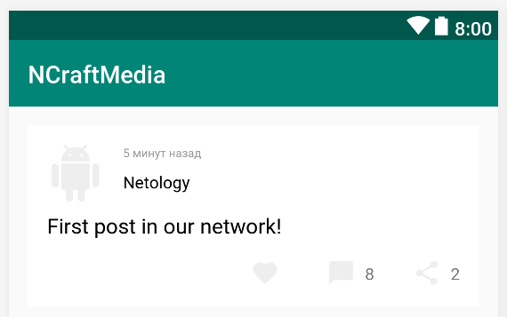

# Домашнее задание к лекции "Первое Android приложение"

Для каждой задачи создайте решение на базе Gradle и залейте его в GitHub.

Для этого ДЗ вы можете сдавать всё в виде одного проекта, реализовав требования всех трёх задач.

Примечание:* если вы сдаёте всё в виде одного проекта, то финальный вариант должен выглядеть как самая последняя реализованная задача, с учётом всей функциональности предыдущих.

## Задача №1 - Карточка поста

Реализуйте карточку поста с помощью `ConstraintLayout`, выглядящую следующим образом:



Кроме того, реализуйте класс `Post` с минимально необходимым набором полей, для хранения информации о подобной записи.

Дату храните в виде строки.

Если пользователь уже лайкал, комментировал или шарил сообщение, то соответствующие кнопки окрашиваются в красный цвет:



Для окрашивания текста используйте member-функцию [`setTextColor`](https://developer.android.com/reference/kotlin/android/widget/TextView.html#setTextColor(kotlin.Int))

Важно замечание: если количество лайков, комментариев или "шарингов" сообщения равно 0, то текст не отображается:



Расстояние от иконок до текста: 16dp

Расстояние до следующей иконки: 32dp

Размер текста основного контента: 18sp

Цвет текста основного контента: #000000


## Задача №2 - Лого и автор

Android Studio умеет использовать картинки не только из встроенного набора. Вы можете импортировать локальный SVG файл с помощью соответствующего переключателя:



После чего из формата SVG картинка будет преобразована в формат Drawable:



Мастер импорта не предлагает вам изменить цвет, т.к. SVG может содержать не только один цвет. Но поскольку xml-файл - это обычный текстовый файл, вы можете вручную отредактировать цвета, установив цвет иконки в #EEEEEE.

После чего, используя `ImageView` и атрибут `srcCompat` установите загруженную иконку (файл `android.svg` из этого репозитория), чтобы внешний вид карточки был следующим:



Размер аватарки: 48dp

Размер шрифта даты: 10sp

Цвет шрифта даты: #999999

Цвет шрифта автора (Netology): #000000

Обращаем внимание, что атрибуты в неймспейсе `tools` (например, `tools:srcCompat`) в редакторе всегда отображаются с иконкой гаечного ключа (нижний на картинке):



Дополнительно: подумайте, что будет, если автор (в нашем случае - `Netology`) будет такой длины, что не уместиться на экране? Заодно посмотрите на атрибут `android:ellipsize`.


## Задача № 3 (необязательная) - Время

Чаще всего дату хранят в виде таймстампа (количество секунд, прошедших с первого января 1990 года) и переводят в конкретную дату/время уже на устройстве пользователя. Таким образом, в Post'е вам придёт именно таймстамп (пусть это будет поле `created`).

Можете воспользоваться веб-сайтом [https://www.unixtimestamp.com](https://www.unixtimestamp.com) для генерации и парсинга таймстампа.

Воспользуйтесь вызовом `System.currentTimeMillis()` - для получения количества **миллисекунд**, прошедших с первого января 1990 года.

Используйте вашу функцию из третьей задачи первого ДЗ, чтобы на базе этих двух величин (таймстампа публикации поста и текущего таймстампа) рассчитать строку формата "минуту назад", "5 минут назад" и т.д.

Напоминаем ту задачу:

"Вы решили написать функцию, которая из количества секунд генерирует человекопонятное представление времени публикации, например:

* publishedAgo: 30
* результат: менее минуты назад

* publishedAgo: 90
* результат: минуту назад"



---

Информация ниже предоставлена для ознакомления: вы должны понимать реальные проблемы, которые связаны и с временем, и с версиями API Android.

Современный набор классов для работы с датой и временем расположен в package `java.time`: [https://developer.android.com/reference/java/time/LocalDateTime.html](https://developer.android.com/reference/java/time/LocalDateTime.html)

Но вот незадача, он поддерживается только с API v26, напоминаем, вы можете поменять версию API в файле `build.gradle`: 

```gradle
android {
    compileSdkVersion 29
    buildToolsVersion "29.0.2"
    defaultConfig {
        applicationId "ru.netology.kotlin.ncraftmedia"
        minSdkVersion 21 // можно выставить версию 26!
        targetSdkVersion 29
        versionCode 1
        versionName "1.0"
        testInstrumentationRunner "androidx.test.runner.AndroidJUnitRunner"
    }
    buildTypes {
        release {
            minifyEnabled false
            proguardFiles getDefaultProguardFile('proguard-android-optimize.txt'), 'proguard-rules.pro'
        }
    }
}
```

Но тогда вы потеряете определённый процент пользователей.

Вы можете подключить сторонние библиотеки, например:
* https://github.com/dlew/joda-time-android
* https://github.com/JakeWharton/ThreeTenABP

Но тогда это увеличит размер вашего приложения и снизит скорость его работы (почитайте комментарии в README этих библотек).

Кроме того, есть ещё несколько вариантов.

Но ключевое - вы должны задать себе вопрос (и Заказчику вашего приложения), насколько критична точность того, что вы собираетесь отображать (стоит ли усложнять код)?

Если это финансовые документы, платежи - то критична.

Если это время публикации поста, то, возможно, точность не очень-то и важна. И в этом случае можно воспользоваться самым простым методом.
